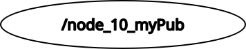
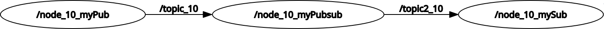

# Universidad Politecnica de Madrid, ETSIT <!-- omit in toc -->

## Deliverables Report <!-- omit in toc -->

Daniel Hojný ([daniel.hojny@fs.cvut.cz](mailto:daniel.hojny@fs.cvut.cz))  
CTU Prague, Faculty of Mechanical Engineering

Athens, Session March 2026  
Course UPM168: Robotics Applications with ROS2: From Basics to Integration  
Professors and tutors:  Pablo Romero, Álvaro Gutiérrez Martín, Sergio López  

### Table of contents <!-- omit in toc -->

- [1 Introduction to ROS2](#1-introduction-to-ros2)
- [2 Basics of ROS2](#2-basics-of-ros2)
  - [2.2 ROS 2 environment](#22-ros-2-environment)
  - [2.1 Publisher](#21-publisher)
  - [2.2 Publisher \& subscriber](#22-publisher--subscriber)
  - [2.2 Interfaces, messages](#22-interfaces-messages)
  - [2.3 Services](#23-services)
  - [2.4 Parameters](#24-parameters)
- [3 Deliverables](#3-deliverables)
  - [D.1 Adding the STM hardware to the ROS2 environment](#d1-adding-the-stm-hardware-to-the-ros2-environment)
  - [D.2 Implement the STM ROS2 Control Node](#d2-implement-the-stm-ros2-control-node)
  - [D.3 Create Launch files](#d3-create-launch-files)
  - [D.4 Visualizing the STM in RVIZ2](#d4-visualizing-the-stm-in-rviz2)
  - [D.5 Integrating the STM serial node to control the Turtlesimin Gazebo](#d5-integrating-the-stm-serial-node-to-control-the-turtlesimin-gazebo)

## 1 Introduction to ROS 2

## 2 Basics of ROS 2

### 2.2 ROS 2 environment

### 2.1 Publisher

First practical task of the course was to setup a simple publisher node.

Bellow is the example  `my_publisher_node` which uses ROS 2 standard message type
[Twist](https://github.com/ros2/common_interfaces/blob/rolling/geometry_msgs/msg/Twist.msg):

```
Vector3  linear
Vector3  angular
```


Running nodes can be displayed using command `ros2 node list`:


The same works for topics:


For visualisation of current structure of nodes and topics, command `rqt_graph` can be used:



### 2.2 Publisher & subscriber

Next step was adding more nodes, which publish/subscribe to different topics. Node `my_pubsub_node` subscribes to `topic_10` from [previous part](#21-publisher) and publishes `topic2_10` which is then subscribed by `my_subscriber_node`.

Message type published by `my_pubsub_node` is user-defined:

```bash
float32     my_float
float32[]   my_float_array
string      my_string
```


As mantioned before, list of nodes and topics can be printed:


Using `rqt_graph` the whole communication structure is clearly visible:



### 2.2 Services


### 2.3 Parameters


## 3 Deliverables

### D.1 Adding the STM hardware to the ROS2 environment

### D.2 Implement the STM ROS2 Control Node

### D.3 Create Launch files

### D.4 Visualizing the STM in RVIZ2

### D.5 Integrating the STM serial node to control the Turtlesimin Gazebo

